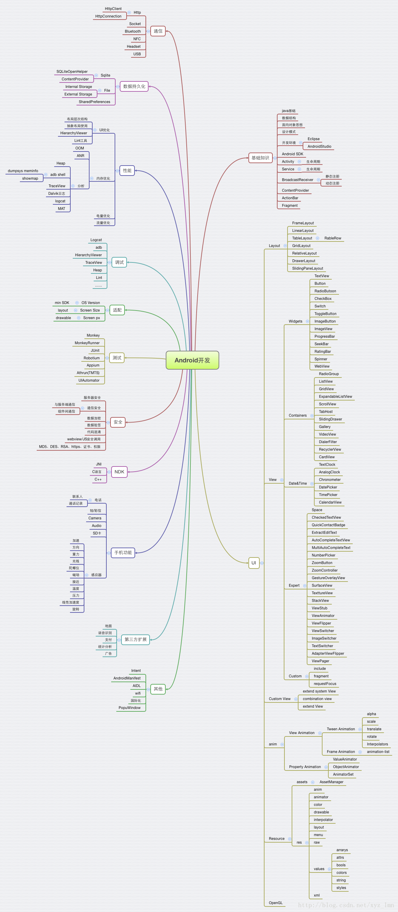

# AndroidJourney
The Journey Of Android

### 安卓相关技术栈

### 安卓入门相关书籍

* [Android编程权威指南 第3版.pdf](https://github.com/Beyond-Chao/AndroidJourney/blob/master/books/Android%E7%BC%96%E7%A8%8B%E6%9D%83%E5%A8%81%E6%8C%87%E5%8D%97%20%E7%AC%AC3%E7%89%88.pdf)

* [第一行代码 Android 第2版](https://github.com/Beyond-Chao/AndroidJourney/blob/master/books/%E7%AC%AC%E4%B8%80%E8%A1%8C%E4%BB%A3%E7%A0%81%20Android%20%E7%AC%AC2%E7%89%88-%E9%83%AD%E9%9C%96-%E4%BA%BA%E9%82%AE-2016.12-P580.pdf)

### 安卓进阶书籍

还没涉及，未完待续

### 优秀项目

* [Java篇](https://github.com/topics/android?l=java&o=desc&s=stars)

* [Kotlin篇](https://github.com/topics/android?l=kotlin&o=desc&s=stars)

* [Android Guide](https://github.com/codepath/android_guides)

* [AndroidUtilCode](https://github.com/Blankj/AndroidUtilCode)

* [Clean Architecture](https://github.com/android10/Android-CleanArchitecture)

### 优秀博客及开发者

* [android-dev-cn](https://github.com/android-cn/android-dev-cn)
* [android-dev-com](https://github.com/android-cn/android-dev-com)

### 工欲善其事，必先利其器

Android Studio `常用`快捷键 (for Mac)，亲测好用。
 
键 | 说明 |
-|-
⌥ | option / alt
⇧ | shift
⌃ | control
⌘ | command

查找相关

快捷键 | 功能 |  
-|-
⌘O | 全局查找 class 类名 | 
⌘F | 在当前编辑文件中查找 |
⌘F12 | 当前编辑的文件中结构快速导航 |
⌘F7 | 列出全局项目中该类／方法 被引用／调用的情况 |
⌘E | 打开最近访问的文件列表 |
⇧⌘O | 全局项目查找文件 |
⌘P | 列出函数方法一系列的有效参数，在调用方法的时候 |
F1 | 查看类，方法的注释文档 |

控制操作相关

快捷键 | 功能 |  
-|-
⇧⌥up/down | 移动行上下移动 |
⌘d | 复制行 |
⌘J | 快速生成模版代码块，如if,while,return, 单例，const等
⌘N | 快速生成getter／setter方法，构造方法，toString()方法等
⌥Enter | 项目快速修复（导包）
⌥⌘L | 代码格式化
⌘⇧U | 切换选中内容的大小写，命名全局常量时比较有用
